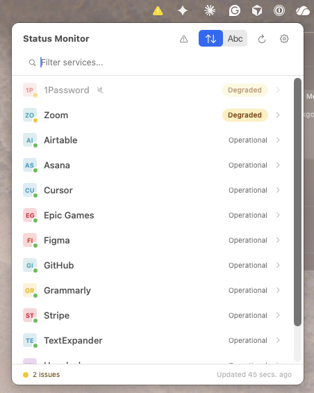

# Nazar

Nazar watches the services you depend on, right from your macOS menu bar.

[**usenazar.com**](https://usenazar.com/) · [Download](https://github.com/moollaza/nazar/releases) · [Request a service](https://github.com/moollaza/nazar/issues/new?template=service_request.yml)



## Features

- Monitor 1,600+ services from your menu bar
- Outage alerts and service updates for tools you rely on
- Built-in catalog with one-click setup (5 services in under 60 seconds)
- Color-coded menu bar icon (green/yellow/orange/red)
- Supports Atlassian Statuspage, incident.io, and RSS/Atom feeds
- Configurable per-service poll intervals
- Native macOS app (SwiftUI, no Electron)
- Free and source-available ([FSL 1.1](https://fsl.software/), converts to Apache 2.0 in 2028)

## Install

Download the latest `.dmg` from [GitHub Releases](https://github.com/moollaza/nazar/releases).

Requires macOS 14 (Sonoma) or later.

## Development Setup

**Prerequisites:** Xcode 15+, macOS 14+

```bash
git clone https://github.com/moollaza/nazar.git
cd nazar
open StatusMonitor.xcodeproj
```

Build and run the `StatusMonitor` scheme in Xcode.

The internal Xcode project, target, and scheme still use `StatusMonitor` for build continuity. The shipped app name is Nazar.

**CLI build:**

```bash
xcodebuild -project StatusMonitor.xcodeproj -scheme StatusMonitor -configuration Release build
```

## Releasing

One-time setup:

**1.** (Optional but recommended) Install `create-dmg` for a polished install-DMG layout with the app icon + "drag to Applications" arrow:

```bash
brew install create-dmg
```

The release script works without it — falls back to a plain DMG + symlink. Drag-to-install still works, just no background image.

**2.** Store your Apple notarization credentials in the macOS Keychain:

```bash
xcrun notarytool store-credentials AC_PASSWORD \
    --apple-id <your-apple-id-email> \
    --team-id W4HBM3A7DC \
    --password <app-specific-password>
```

Generate the app-specific password at [appleid.apple.com](https://appleid.apple.com) → Sign-In and Security → App-Specific Passwords. The credentials live in your Keychain; `AC_PASSWORD` is just the default profile name the release script references. Set `KEYCHAIN_PROFILE=<profile>` when running the script to use a different profile name.

Build a signed, notarized, stapled DMG:

```bash
scripts/release.sh
```

Output: `build/release/Nazar-<version>.dmg`.

For a local smoke test without hitting Apple's notary service:

```bash
scripts/release.sh --skip-notarize
```

## Tech Stack

- Swift 5.9+, SwiftUI
- `@Observable` (Swift 5.9 macro)
- `URLSession` for network polling
- App Sandbox with `com.apple.security.network.client`
- `LSUIElement` menu bar accessory (no Dock icon)
- Static website in `website/`, deployed to Cloudflare Pages

## Contributing

See [CONTRIBUTING.md](CONTRIBUTING.md) for guidelines. To request a missing service, use the [Service Request issue template](https://github.com/moollaza/nazar/issues/new?template=service_request.yml).

## License

[Functional Source License 1.1](https://fsl.software/) (FSL-1.1-Apache-2.0) -- see [LICENSE](LICENSE) for details. Converts to Apache 2.0 on 2028-04-12.
